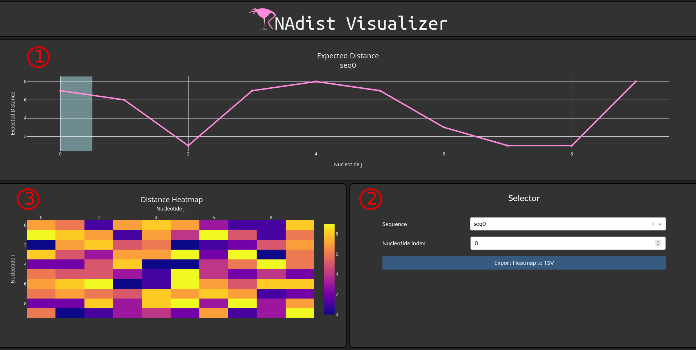

Visualization
=============

Run It
------

It is possible to visualize all kind of predictions using the shipped Dashboard

Therefore simply type:

.. code-block:: bash

    RNAdist visualize --input path/to/pediction/file.pckl --fasta path/to/fasta

This will run the dash server using the default port and ip address. You can now use the application if you open your
browser and type http://127.0.0.1:8080/ into the url bar.

.. note::

    The :code:`--fasta` flag is optional but it will include additional information about nucleotides during
    visualization

RNAdist Visualizer
------------------

Now that you started the visualization. It is time to talk about what you see here.
In the bottom right you can find the selector pane [2]. Here you can select the Fasta header of the sequence you want to
inspect.

.. note::

    The Dropdown Menu is restricted to 100 entries. If your prediction file has more sequences, start typing the name
    of the sequence you search for and it will show up.

Via the Nucleotide Index input you can specify for which nucleotide expected distances should be shown in the upper
distance graph [1].

Last but not least there is a heatmap [3] in the lower left corner showing distances for all nucleotide combinations.
You can download this heatmap as a tsv file using the `Export Heatmap to TSV` Button in the Selector Pane.

